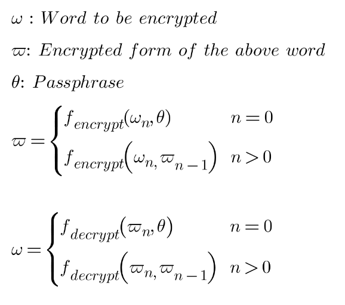
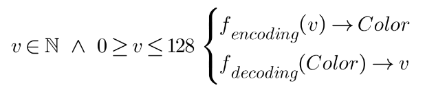
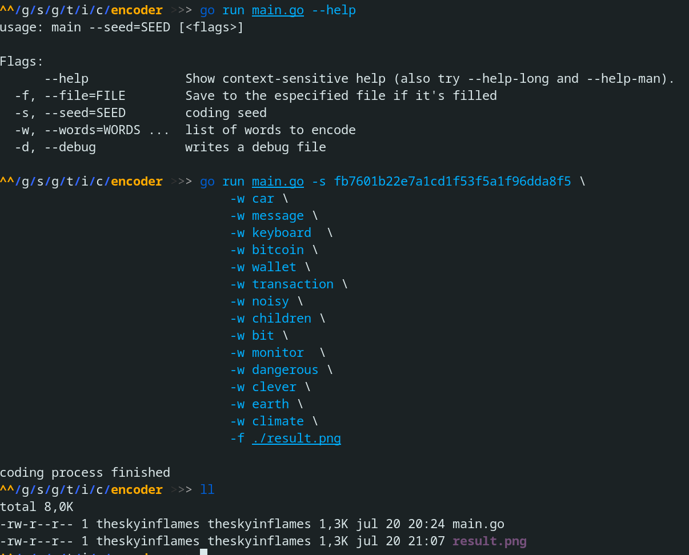
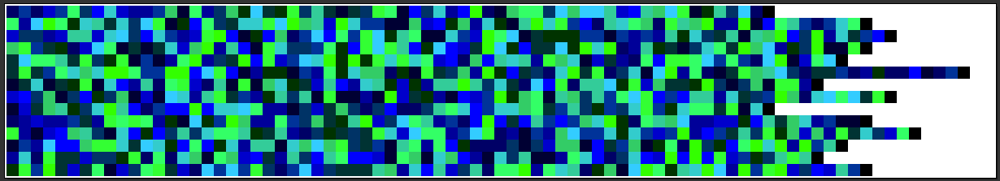
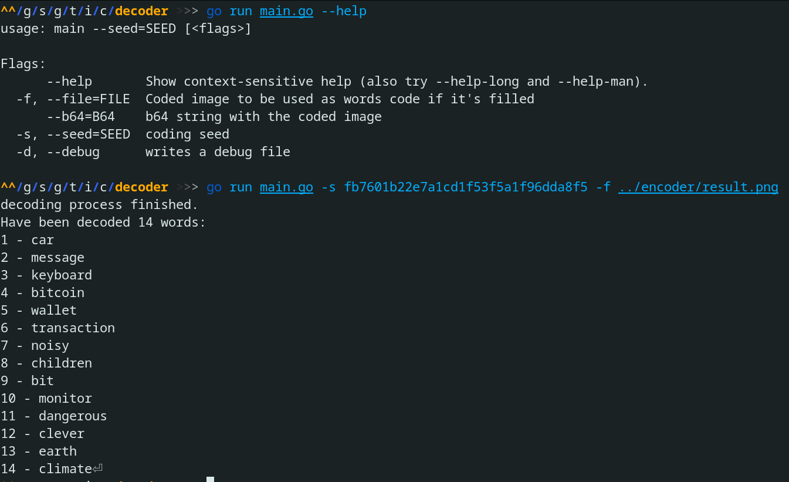

# Image Encoder
From a given passphrase and a list of words, this is a tool that encrypts the words using the AES-256 algorithm and encodes the encrypted result into a PNG image. Later, this image is decoded to get back the original sequence of words. The generated PNG image has these characteristics:

* Each line of pixels is an encrypted word
* Words appear in the image in the same order top->down that they have been provided to the tool.

## License
All this tool is under [GPL V3 license](https://www.gnu.org/licenses/gpl-3.0.txt)

## How it works - Encoding
First of all, the provided words are encrypted using AES-256 encryption in a *chain* mode. I mean, except for the first word, which is encrypted using the provided passphrase, the rest of the words are encrypted using the previous encrypted word as a passphrase. 

It prevents modifying the sequence of words.

Once we have the words encrypted, we need a bijective function to encode the encrypted words in a sequence of colors in the PNG file. But we also want that this relation between each *byte* and its color depended on the passphrase. So if the passphrase changes, this relation will also change. It's achieved by using the MD5 checksum of the passphrase. It is a 128 bytes signature length, or in other words, it allows to encode 128 values into 128 colors. Here, two bijective functions are built, the first one to encode and the second one to decode: 

But this function only manages values *0 ≥ V ≤ 2^4*, and each byte to encode can take them from 0 to *2^8*. To fix it, each byte is split into two bytes, one of them with the high part and another one with the low part. For example, a byte *10111001* is split into two bytes: *00001011* (high part) and *00001001* (low part). By doing so, we ensure that all bytes to be encoded to colors will have values in the domain of the bijective function. 

## How it works - decoding
To decode the sequence of words encoded in a PNG image, it's taken into account that:
* Each line of pixels is an encoded-word
* Every two pixels of the same line corresponds to an individual byte of the encrypted form of the word. Remember that it's so because, during the encoding process, each byte is split into two bytes.

So the decoding process consist, basically on:
1. Read a line of pixels
2. Decode the byte of each pixel from its color
3. Combine the bytes in pairs to get the original encrypted form of the word
4. Decrypt the word

## Usage
There are two programs:
* *cmd/encoder/main.go* : The encoder
* *cmd/decoder/main.go* : The decoder

Although this tool is intended to get a PNG image as the encoding result, you also can get it in Base64 instead. See *--help* option for encoder/decoder

### Encoding
As it has already been explained before, to encode a list of words, a passphrase is needed. 

This is the generated image:

## Decoding
To get back the words encoded in the above image, the passphrase is needed:

## TODO
* Some refactors on the code to make it simpler 
* Add RSA encryption support
* Add a GraphQL API

## Disclaimer
I've coded it **only for fun**. Use it on your responsibility.

## References
[encrypt/decrypt using AES 256 algorithm](https://www.thepolyglotdeveloper.com/2018/02/encrypt-decrypt-data-golang-application-crypto-packages/)

[bijective function](https://es.wikipedia.org/wiki/Funci%C3%B3n_biyectiva#:~:text=En%20matem%C3%A1ticas%2C%20una%20funci%C3%B3n%20es,elemento%20del%20conjunto%20de%20salida.)

[online equations editor](http://www.imatheq.com/)