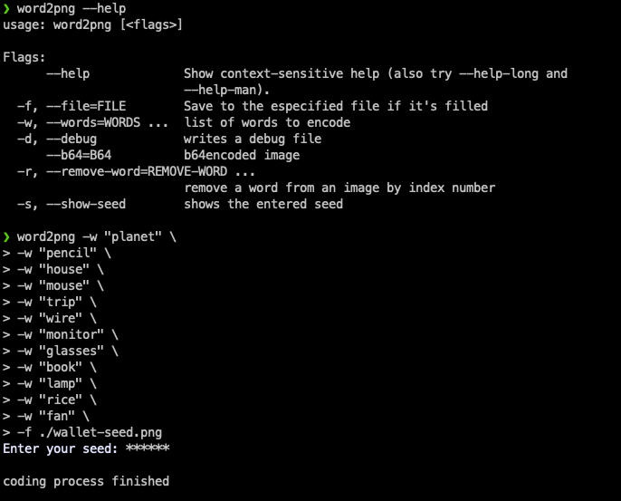
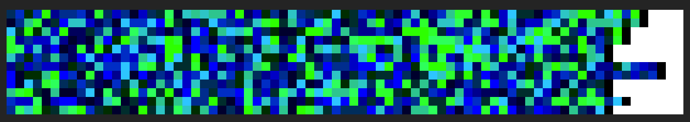
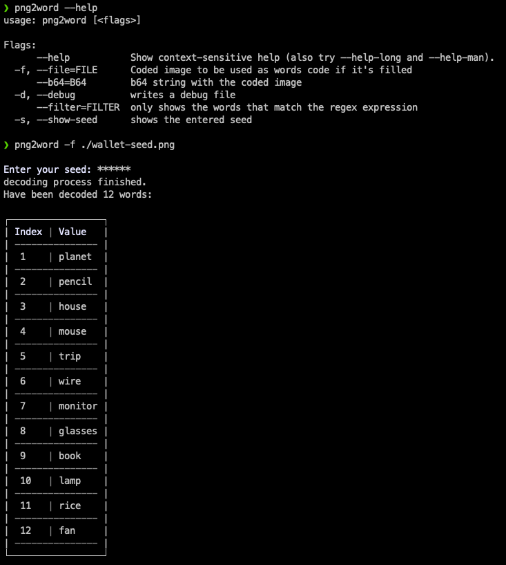

# word2png
This is a tool that encrypts a sequence of words (or pieces of texts) using the AES-256 algorithm and encodes the encrypted result into a PNG image by linking each byte value to a specific color, using two colors for each byte (read below). Later, this image is decoded to get back the original sequence of words. The generated PNG image has these characteristics:

* Each line of pixels is an encrypted word
* Words appear in the image in the same order top->down that they have been provided to the tool.

## Motivation
I have several friends who have a [crypto concurrency wallet](https://en.wikipedia.org/wiki/Cryptocurrency_wallet). One of the steps to configure these wallets is to provide an ordered sequence of unencrypted seed phrases as a private key. That means that if anyone stoles your seed phrases, they will have access to your cryptocurrencies because they will have your digital signature. To avoid that, my friends encrypt their seed phrases. But not all of them have encryption algorithm knowledge enough, so some use low-safe methods to encrypt their seed phrases. 
Apart from that, it's not easy for them to store safety the encrypted values of their seed phrases. Remember that an encrypted word is a byte array. 
Taking all before into account, I've thought to provide them an easy way to manage their encrypted seed phrases. By storing it as a PNG image. You can keep it on any device or cloud storage you want. Don't care if someone has access to it, even if they copy it. Without the passphrase you used to encode it, they will not decode it.
Yes, I know. You can argue that you still have to keep safe the passphrase that has been used to encode the PNG image. You're right. But only one instead of 24 or 32. It's up to you to store it safely. You could, for example, use a password manager or even encode it with another passphrase.

## License
All this tool is under [GPL V3 license](https://www.gnu.org/licenses/gpl-3.0.txt)

## Installation
```sh
    make install
```
This will install two binaries:
* *word2png* : The encoder
* *png2word* : The decoder

## Usage
First, we encode a sequence of words into a PNG image. Next we decode this PNG image to get back the sequence of words.

Although this tool is intended to get a PNG image as the encoding result, you also can get it in Base64 instead. See *--help* option for encoder/decoder

### Encoding
As it has already been explained before, to encode a list of words, a passphrase is needed. 



This is the generated image:



## Decoding
To get back the words encoded in the above image, the passphrase is needed:



## How it works - Encoding
First of all, the provided words are encrypted using AES-256 encryption in a *chain* mode. I mean, except for the first word, which is encrypted using the provided passphrase, the rest of the words are encrypted using the previous encrypted word as a passphrase. 


It prevents modifying the sequence of words.

Once we have the words encrypted, we need a bijective function to encode the encrypted words in a sequence of colors in the PNG file. But we also want that this relation between each *byte* and its color depended on the passphrase. So if the passphrase changes, this relation will also change. It's achieved by using the MD5 checksum of the passphrase. It is a 128 bytes signature length, or in other words, it allows to encode 128 values into 128 colors. Here, two bijective functions are built, the first one to encode and the second one to decode: 


But this function only manages values *0 ≥ V ≤ 2^4*, and each byte to encode can take them from 0 to *2^8*. To fix it, each byte is split into two bytes, one of them with the high part and another one with the low part. For example, a byte *10111001* is split into two bytes: *00001011* (high part) and *00001001* (low part). By doing so, we ensure that all bytes to be encoded to colors will have values in the domain of the bijective function. 

## How it works - decoding
To decode the sequence of words encoded in a PNG image, it's taken into account that:
* Each line of pixels is an encoded-word
* Every two pixels of the same line corresponds to an individual byte of the encrypted form of the word. Remember that it's so because, during the encoding process, each byte is split into two bytes.

So the decoding process consist, basically on:
1. Read a line of pixels
2. Decode the byte of each pixel from its color
3. Combine the bytes in pairs to get the original encrypted form of the word
4. Decrypt the word

## TODO
* Some refactors on the code to make it simpler 
* Add RSA encryption support
* Add Github actions to pass tests and linter
* Improve the debug stream management

## Disclaimer
I've coded it only for fun. Please read the LICENSE. I hope you enjoy using it as much as I enjoyed building it. All ideas are welcome. Please let me know what you would add or change.

## References and resources
[encrypt/decrypt using AES 256 algorithm with Go](https://www.thepolyglotdeveloper.com/2018/02/encrypt-decrypt-data-golang-application-crypto-packages/)

[online AES256 encrypter/decrypter](https://encode-decode.com/aes256-encrypt-online/)

[bijective function](https://es.wikipedia.org/wiki/Funci%C3%B3n_biyectiva#:~:text=En%20matem%C3%A1ticas%2C%20una%20funci%C3%B3n%20es,elemento%20del%20conjunto%20de%20salida.)

[online equations editor](http://www.imatheq.com/)

[golang project structure](https://raygervais.dev/articles/2020/11/understanding-golang-project-structure)
